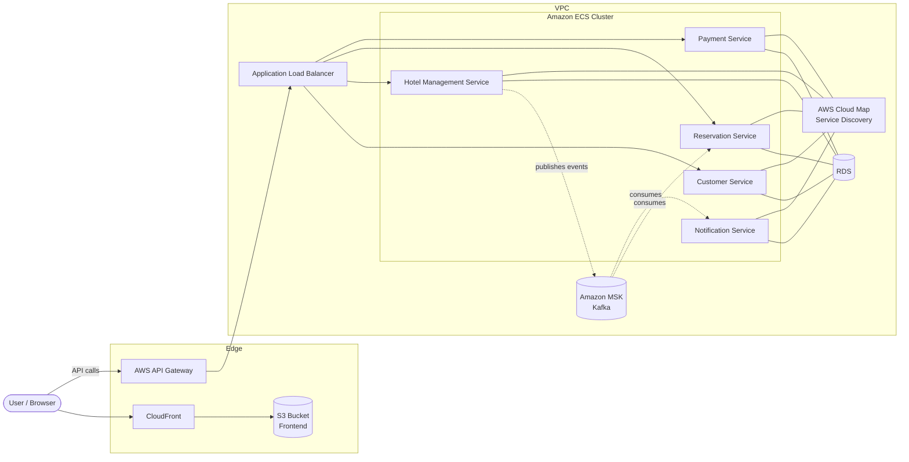
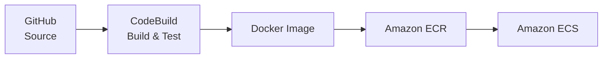

# 🏨 Hotel Management System: Event-Driven Microservices on AWS

A cloud-native hotel management platform built as a set of independently deployable microservices. The system handles customer management, hotel and room inventory, reservations, payments, and notifications. Services communicate asynchronously through **Apache Kafka (Amazon MSK)** and run on **Amazon ECS** behind **AWS API Gateway** and an **Application Load Balancer**, with fully automated CI/CD through **AWS CodePipeline**.

---

## 📑 Table of Contents

- [Highlights](#-highlights)
- [Architecture Overview](#-architecture-overview)
- [Microservices](#-microservices)
- [Local vs. AWS Architecture](#-local-vs-aws-architecture)
- [Event-Driven Communication](#-event-driven-communication)
- [AWS Infrastructure](#-aws-infrastructure)
- [CI/CD Pipeline](#-cicd-pipeline)
- [Tech Stack](#-tech-stack)
- [Running Locally](#-running-locally)
- [Lessons Learned](#-lessons-learned)

---

## ✨ Highlights

- **5 microservices** designed around clear business boundaries (customer, hotel, reservation, payment, notification) plus infrastructure services (gateway, discovery).
- **Event-driven architecture** using Kafka on Amazon MSK to decouple services and support eventual consistency across the reservation, notification, and  hotel management microservices.
- **Containerized deployment** on Amazon ECS with images stored in Amazon ECR and one task definition per service.
- **Automated CI/CD**: 6 AWS CodePipelines pull from GitHub, build, push images to ECR, and roll out new ECS deployments.
- **Cloud-native service discovery** with AWS Cloud Map, replacing Eureka in the cloud environment.
- **Static frontend** hosted on Amazon S3 and served globally through Amazon CloudFront.

---

## 🏗 Architecture Overview



**Request flow:**

1. The user loads the frontend from **CloudFront**, which serves static assets from **S3**.
2. The frontend calls backend APIs through **AWS API Gateway**.
3. API Gateway forwards requests to the **Application Load Balancer**, which routes by path to the correct **ECS service**.
4. Services resolve each other internally through **AWS Cloud Map**.
5. Business events (reservation created, payment processed, etc.) flow through **Amazon MSK**, where downstream services consume them asynchronously.

---

## 🧩 Microservices

| Service | Responsibility | Communication |
|---|---|---|
| **API Gateway** | Single entry point locally; routing, cross-cutting concerns | REST |
| **Eureka Server** | Service registry for local development | REST |
| **Customer Service** | Customer profiles, registration, account data | REST |
| **Hotel Management Service** | Hotels, rooms, room types, availability | REST + Kafka producer |
| **Reservation Service** | Booking lifecycle: create, modify, cancel | REST + Kafka consumer |
| **Payment Service** | Processes payments for reservations | REST |
| **Notification Service** | Sends booking and payment confirmations | Kafka consumer |

Each service owns its own data and exposes a focused API, following the **database-per-service** principle.

---

## 🔄 Local vs. AWS Architecture

A key design decision was letting the infrastructure layer change between environments while keeping business services the same.

| Concern | Local | AWS |
|---|---|---|
| Entry point / routing | API Gateway service | AWS API Gateway + Application Load Balancer |
| Service discovery | Eureka Server | AWS Cloud Map |
| Messaging | Local Kafka broker | Amazon MSK |
| Frontend hosting | Local dev server | S3 + CloudFront |
| Container orchestration | Docker / Docker Compose | Amazon ECS |
| Image registry | Local images | Amazon ECR |


This is why **7 services run locally** while **5 business services are deployed** through CodePipeline: in AWS, managed services take over gateway and discovery responsibilities, which cuts operational overhead and removes two single points of failure.

---

## 📨 Event-Driven Communication

Services coordinate the booking workflow through Kafka topics instead of synchronous chains of REST calls. This keeps services loosely coupled and lets each one scale and fail independently.


| Topic | Producer | Consumers |
|---|---|---|
| `reserve-room` | Hotel Management | Reservation |
| `room-ready-notification` | Hotel Management |  Notification |
---

## ☁️ AWS Infrastructure

| AWS Service | Purpose |
|---|---|
| **Amazon ECS** | Runs each microservice as a containerized service based on its own task definition |
| **Amazon ECR** | Stores versioned Docker images for each service |
| **AWS CodePipeline** | Orchestrates CI/CD from GitHub to ECS |
| **AWS CodeBuild** | Builds the application and Docker images |
| **Amazon MSK** | Managed Kafka cluster for asynchronous event streaming |
| **AWS API Gateway** | Public API entry point for the frontend |
| **Application Load Balancer** | Path-based routing to ECS services, health checks |
| **AWS Cloud Map** | Service discovery between ECS services |
| **Amazon S3** | Hosts the static frontend build |
| **Amazon CloudFront** | CDN for the frontend with caching and HTTPS |
| **RDS** | Insert data to the database |
| **IAM** | Least-privilege roles for ECS tasks, CodePipeline, CodeBuild, Lambda, and other services |

---

## 🚀 CI/CD Pipeline



**Pipeline stages:**

1. **Source:** A push to GitHub triggers the pipeline.
2. **Build:** CodeBuild compiles the service, runs tests, and builds a Docker image (defined in `buildspec.yml`).
3. **Push:** The image is tagged and pushed to the service's ECR repository.
4. **Deploy:** ECS registers a new task definition revision and rolls out updated tasks.

**Pipelines:** Customer · Hotel Management · Reservation · Payment · Notification, FE(Frontend)

Note: Each deployed service has its own pipeline, so services can be released independently.
---

## 🛠 Tech Stack


1. **Backend:** Java, Spring Boot, Spring Cloud (Gateway, Netflix Eureka), Spring Kafka, Spring Data JPA
2. **Messaging:** Apache Kafka / Amazon MSK
3. **Frontend:** Angular, TypeScript, hosted on S3 + CloudFront
4. **Database:** MySQL, RDS
5. **DevOps:** Docker, AWS CodePipeline, AWS CodeBuild, Amazon ECR, Amazon ECS
6. **Networking:** AWS API Gateway, Application Load Balancer, AWS Cloud Map, VPC

---

## 💻 Running Locally

```bash
# 1. Clone the repository
git clone https://github.com/<your-username>/<repo-name>.git
cd <repo-name>

# 2. Start Kafka and supporting infrastructure
docker compose up -d

```

| Service | Local Port |
|---|---|
| Eureka Server | `8761` |
| Customer | `8080` |
| Reservation | `8081` |
| Hotel Management | `8082` |
| Payment | `8083` |
| Notification | `8084` |
| API Gateway | `8085` 

---

## 📚 Lessons Learned

- **Managed services vs. self-hosted infrastructure:** Replacing Eureka and the gateway service with Cloud Map and AWS API Gateway simplified the deployed system and removed services I would otherwise have to operate and scale.
- **Asynchronous workflows need careful design:** Kafka decouples services, but it introduces eventual consistency, so failure handling and idempotent consumers become essential.
- **Networking is the hardest part of cloud deployment:** VPC subnets, security groups, load balancer target groups, and MSK connectivity took more effort than writing the services themselves.
- **Independent pipelines enable independent releases:** One pipeline per service means a change to Payment never requires redeploying Reservation.

---

